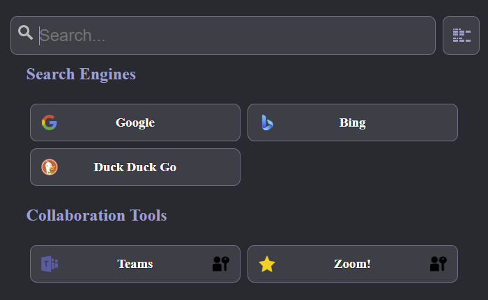

# Introduction

**My Links page** is a simple HTML web page to store links to web sites just like bookmarks, but **My Links Page** can be shared between web browsers, by setting as the default home page or by creating a shortcut. **My Links Page** can be open directly from the machine hard disk or stored in a web server.

# Images

An example of some links displayed in the button layout.



# Table of contents

* [Usage](#usage)
* [Configuration](#configuration)

## Usage

The **My Links Page** can be used in several ways. On the desktop/task bar as a shortcut, configured as the default page in a web browser. I can be open directly from a directory or copied to a web server and accessed as a normal web page. Images for icons and card backgrounds can be URLs to external resources of embedded as Base64 strings.

## Configuration

**My Links Page** can be configured by editing the *my_links_page.html* file and modifying the JSON configuration. The configuration is divided in to 3 areas *links*, *groups* and *settings*.

The page has all the code required to work, and external resources are only required if URLs are used in *icons* or *image* in the *links* seciton.

### **links**

In the **links** section you can add

- title: Friendly title for the link.
- description: A brief description.
- url: The URL to open.
- group: The group to add the link to.
- auth: [true|false] If true the link will have an icon to signify that a login is required to access the site.
- icon: [default|favicon|url] What icon should be associated with the links. 
- image: A url to an image to show as the background of the link.

The *icon* and *image* options the *url* can be a URL to an image or a base64 string representation of the image (data:image/png;base64, ...).

> Take care when using images from sites on the internet, depending on the number of links with images and icons, can cause **My Links Page** to download a large number of images.

You can use the [base64 encoder](https://github.com/jpillora/base64-encoder) by **Jaime Pillora** to create the appropriate base64 string and use it instead of a URL to the actual image.

### **groups**

Groups allow the links to be grouped together in the same section.

- name: Name of the group; this parameter is only significant for the application.
- title: The title of the group as shown in the **My Links Page**.

### **settings**

- page_title: The title to be shown in the web browser for the **My Lings Page**.
- layout_design: [button|card] How the links will be presented on the page.
- sort: [asc|desc|false] Defines how the *links* and *groups* will be sorted.


### **base64_images**

Allows storing images/icons encoded in base64, so they can be shared as icons in different links and or as backgrounds.

```json
{
        "base64_images": {
            "star": "data:image/png;base64,iVBORw0KGgoA(...)"
        }
}
```

Which then can be used as an *image* or *icon* property of one or more links.